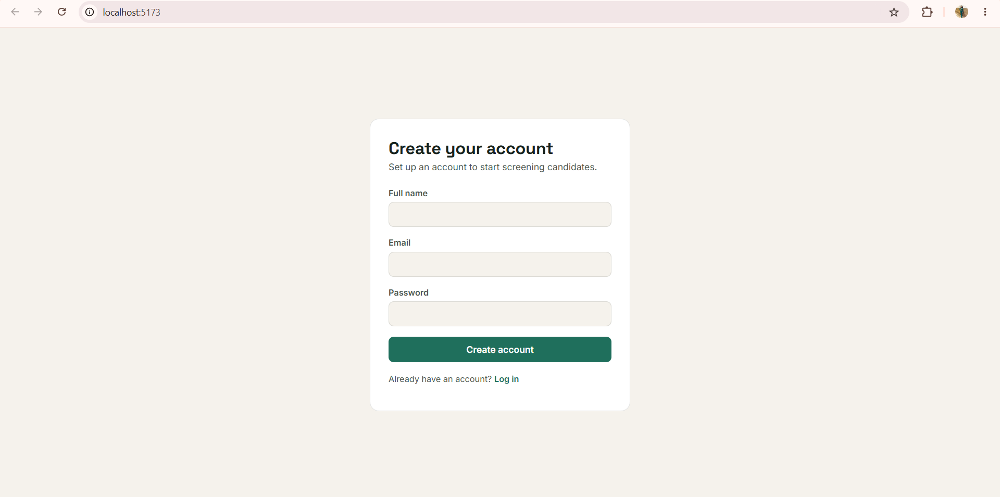
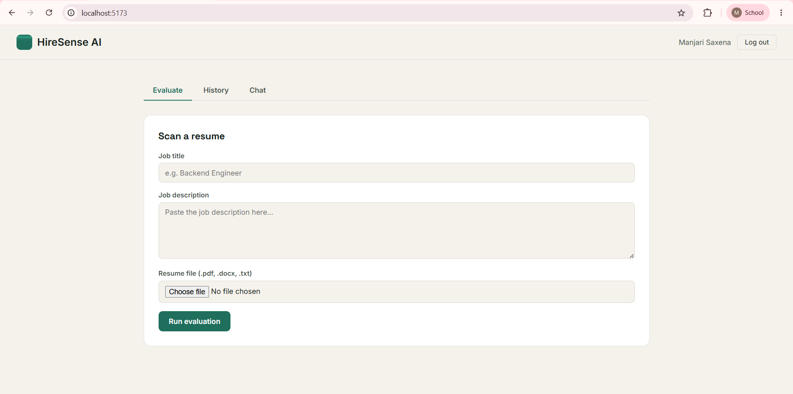
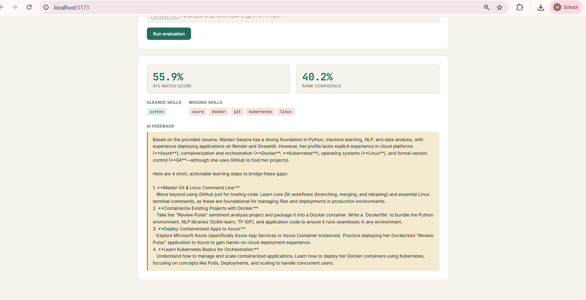
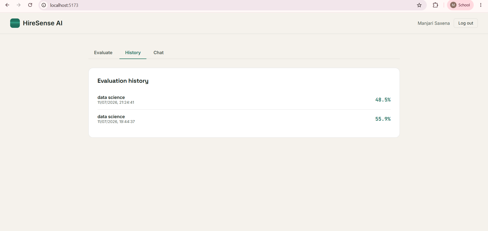
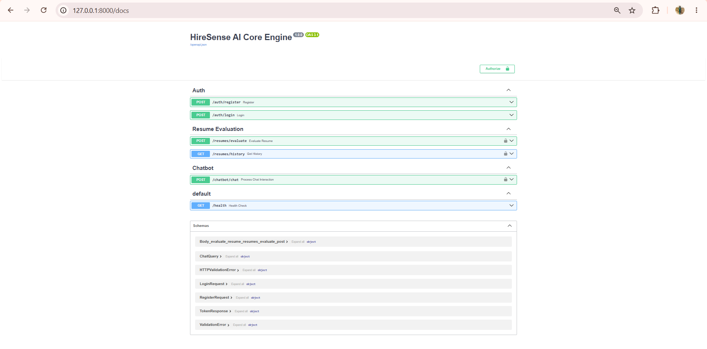

# HireSense AI — Intelligent Hiring Assistant

An end-to-end AI system that evaluates candidate resumes against job requirements using machine learning and deep learning models, and generates personalized, explainable feedback through a retrieval-based intelligent text generation pipeline. It also features a conversational interface for candidate interaction and insights.

Built as part of the JECRC–Celebal Excellence internship program.

**🔗 Live Demo:** _[Add deployed link here once available]_

> The app runs fully locally (see setup below) and is verified working end-to-end. Screenshots of the working application are included below in place of a live demo link, which will be added once hosting is finalized.

---

## Screenshots

**Sign up**


**Resume evaluation**


**Evaluation result with AI feedback**


**Evaluation history**


**API documentation (FastAPI Swagger UI)**


---

## Features

- **Resume Parsing** — Extracts text and skills from PDF/DOCX resumes
- **Hybrid Scoring Engine** — Combines semantic similarity (`sentence-transformers`) with a trained `XGBoost` classifier to rank candidates against a job description
- **Explainable AI Feedback (RAG)** — Uses a FAISS vector store + LangChain `RetrievalQA` pipeline with Google Gemini to generate personalized, actionable feedback on missing skills
- **Conversational Interface** — Chatbot for candidates to interact with and understand their evaluation
- **Authentication** — Secure registration/login with hashed passwords and JWT-based sessions
- **Full-Stack Application** — FastAPI backend with a React (Vite) frontend

---

## Tech Stack

| Layer | Technology |
|---|---|
| Backend | FastAPI, Python 3.11 |
| Frontend | React, Vite |
| Database | MongoDB Atlas |
| Embeddings | sentence-transformers (`all-MiniLM-L6-v2`) |
| ML Ranking | XGBoost |
| RAG / Vector Store | FAISS, LangChain |
| LLM | Google Gemini (`gemini-flash-latest`, `gemini-embedding-001`) |
| Auth | JWT, bcrypt |

---

## Project Structure

```
final_project/
├── backend/
│   ├── app/
│   │   ├── main.py            # FastAPI app entrypoint
│   │   ├── config.py          # Settings / environment config
│   │   ├── database.py        # MongoDB connection
│   │   ├── security.py        # Password hashing, JWT utils
│   │   ├── auth.py
│   │   ├── routers/
│   │   │   ├── auth.py        # Register / login endpoints
│   │   │   ├── resumes.py     # Resume upload & evaluation
│   │   │   └── chatbot.py     # Conversational endpoint
│   │   └── services/
│   │       ├── parser.py      # Resume text & skill extraction
│   │       ├── matcher.py     # Hybrid scoring engine
│   │       └── rag_feedback.py# RAG-based explainable feedback
│   ├── trained_models/        # Trained XGBoost ranker
│   └── requirements.txt
├── frontend/
│   ├── src/
│   │   ├── App.jsx
│   │   ├── api.js
│   │   └── components/
│   │       ├── AuthScreen.jsx
│   │       ├── ChatPanel.jsx
│   │       ├── EvaluatePanel.jsx
│   │       ├── HistoryPanel.jsx
│   │       └── ResultCard.jsx
│   └── package.json
└── docker-compose.yml
```

---

## Running Locally

### Prerequisites
- Python 3.11+
- Node.js 18+
- A MongoDB Atlas connection string
- A Google Gemini API key

### 1. Backend Setup

```bash
cd final_project/backend
python -m venv venv
venv\Scripts\activate        # Windows
# source venv/bin/activate   # macOS/Linux

pip install -r requirements.txt

copy .env.example .env       # Windows
# cp .env.example .env       # macOS/Linux
```

Edit `.env` and fill in:
```
MONGO_URI=your_mongodb_atlas_connection_string
JWT_SECRET=any_random_long_string
GOOGLE_API_KEY=your_gemini_api_key
```

Start the server:
```bash
uvicorn app.main:app
```

Backend runs at `http://localhost:8000`. Verify with `http://localhost:8000/health`, and full interactive API docs at `http://localhost:8000/docs`.

### 2. Frontend Setup

Open a new terminal:
```bash
cd final_project/frontend
npm install

copy .env.example .env       # Windows
# cp .env.example .env       # macOS/Linux
```

Edit `.env`:
```
VITE_API_URL=http://localhost:8000
```

Start the dev server:
```bash
npm run dev
```

Frontend runs at `http://localhost:5173`.

---

## Dataset & Model

The candidate ranking model was trained using the [Resume Dataset (Kaggle)](https://www.kaggle.com/datasets/rayyankauchali0/resume-dataset).

---

## Author

**Manjari Saxena**
MCA (AI & ML), JECRC University, Jaipur
Celebal Technologies Intern — JECRC Celebal Excellence Program
[Portfolio](https://manjarisaxenaportfolio.lovable.app)
