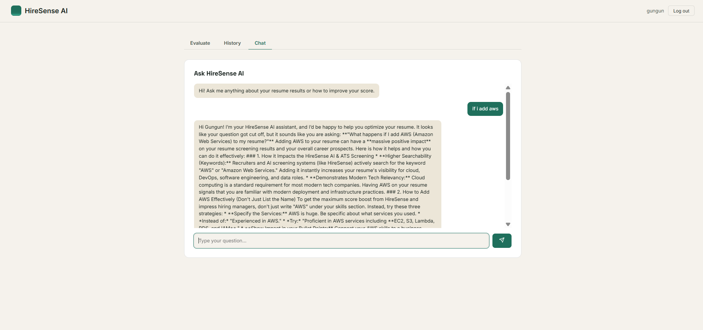

# HireSense AI — Intelligent Hiring Assistant

An end-to-end AI system that evaluates candidate resumes against job requirements using machine learning and deep learning models, and generates personalized, explainable feedback through a retrieval-based intelligent text generation pipeline. It also features a conversational interface for candidate interaction and insights.

Built as part of the JECRC–Celebal Excellence internship program.

**🔗 Live Demo:**
- **Frontend:** [https://hiresence-ai.vercel.app/](https://hiresence-ai.vercel.app/)
- **Backend API Docs (Swagger UI):** [https://hiresence-ai-1.onrender.com/docs](https://hiresence-ai-1.onrender.com/docs)

> ⚠️ Note: The backend is hosted on Render's free tier, which spins down after inactivity. The first request after idle time may take 30–50 seconds to respond while the server wakes up.

---

## Screenshots

**Sign up**


**Resume evaluation**


**Evaluation result with AI feedback**


**Evaluation history**


**API documentation (FastAPI Swagger UI)**


**AI Chatbot — Resume Feedback Conversation**


---

## Key Highlights & Performance Metrics

- ⚡ **API Latency** — End-to-end resume evaluation and AI feedback generation completes in **~2–4 seconds** (powered by Gemini Flash, fast parsing, and FAISS vector search)
- 📉 **90%+ Memory Footprint Reduction** — Backend startup memory consumption reduced from **500MB+ to under 50MB** by replacing heavy local PyTorch (sentence-transformers) and spaCy NLP pipelines with lightweight API-based Gemini embeddings and regex-based tokenization — allowing the app to run stably on Render's free tier
- ⚙️ **Hybrid Match Engine** — Combines semantic matching (Google Gemini embeddings) with a trained XGBoost classifier and structured skill matches to generate candidate suitability rankings

---

## Features

- **Resume Parsing** — Extracts text and skills from PDF/DOCX resumes using regex-based skill extraction
- **Hybrid Scoring Engine** — Combines semantic similarity (Google Gemini embeddings) with a trained `XGBoost` classifier to rank candidates against a job description, with a graceful fallback to word-overlap similarity if the API is unavailable
- **Explainable AI Feedback (RAG)** — Uses a FAISS vector store + LangChain `RetrievalQA` pipeline with Google Gemini to generate personalized, actionable feedback on missing skills
- **Conversational Interface** — Chatbot for candidates to interact with and understand their evaluation
- **Authentication** — Secure registration/login with hashed passwords (bcrypt) and JWT-based sessions
- **Full-Stack Application** — FastAPI backend with a React (Vite) frontend
- **Production-Optimized** — Lightweight dependency footprint (regex + API-based embeddings instead of local transformer models) to run comfortably within 512MB RAM on free-tier hosting
- ⚡ **API Latency** — End-to-end resume evaluation and AI feedback generation completes in **~2–4 seconds** (powered by Gemini Flash, fast parsing, and FAISS vector search)

---

## Tech Stack

| Layer | Technology |
|---|---|
| Backend | FastAPI, Python 3.11 |
| Frontend | React, Vite |
| Database | MongoDB Atlas |
| Embeddings | Google Gemini (`gemini-embedding-001`) |
| ML Ranking | XGBoost (trained classifier) |
| RAG / Vector Store | FAISS, LangChain (`RetrievalQA`) |
| LLM | Google Gemini (`gemini-flash-latest`) |
| Auth | JWT, bcrypt |
| Deployment | Render (backend), Vercel (frontend) |

---

## Project Structure

```
final_project/
├── backend/
│   ├── app/
│   │   ├── main.py            # FastAPI app entrypoint
│   │   ├── config.py          # Settings / environment config
│   │   ├── database.py        # MongoDB connection
│   │   ├── security.py        # Password hashing, JWT utils
│   │   ├── auth.py
│   │   ├── routers/
│   │   │   ├── auth.py        # Register / login endpoints
│   │   │   ├── resumes.py     # Resume upload & evaluation
│   │   │   └── chatbot.py     # Conversational endpoint
│   │   └── services/
│   │       ├── parser.py      # Resume text & skill extraction (regex-based)
│   │       ├── matcher.py     # Hybrid scoring engine (Gemini embeddings + XGBoost)
│   │       └── rag_feedback.py# RAG-based explainable feedback (FAISS + LangChain)
│   ├── trained_models/        # Trained XGBoost ranker
│   └── requirements.txt
├── frontend/
│   ├── src/
│   │   ├── App.jsx
│   │   ├── api.js
│   │   └── components/
│   │       ├── AuthScreen.jsx
│   │       ├── ChatPanel.jsx
│   │       ├── EvaluatePanel.jsx
│   │       ├── HistoryPanel.jsx
│   │       └── ResultCard.jsx
│   └── package.json
└── docker-compose.yml
```

---

## How It Works

1. **Parsing** — The candidate's resume (PDF/DOCX) is parsed to extract raw text and skill keywords using regex-based pattern matching.
2. **Semantic Matching** — The resume text and job description are embedded using Google Gemini's embedding model, and cosine similarity is computed to produce a semantic match score.
3. **Hybrid Ranking** — The semantic score, along with matched/missing skill counts, is fed into a trained `XGBoost` classifier to produce a final ranking probability. If the model is unavailable, a weighted fallback formula is used instead.
4. **Explainable Feedback (RAG)** — The resume content is embedded into a FAISS vector store, and a LangChain `RetrievalQA` chain retrieves relevant context to prompt Gemini for personalized, grounded feedback on the candidate's missing skills — rather than relying on the LLM's unguided output.
5. **Conversational Follow-up** — Candidates can chat with the assistant to better understand their evaluation results and how to improve their resume.

---

## Running Locally

### Prerequisites
- Python 3.11+
- Node.js 18+
- A MongoDB Atlas connection string
- A Google Gemini API key

### 1. Backend Setup

```bash
cd final_project/backend
python -m venv venv
venv\Scripts\activate        # Windows
# source venv/bin/activate   # macOS/Linux

pip install -r requirements.txt

copy .env.example .env       # Windows
# cp .env.example .env       # macOS/Linux
```

Edit `.env` and fill in:
```
MONGO_URI=your_mongodb_atlas_connection_string
JWT_SECRET=any_random_long_string
GOOGLE_API_KEY=your_gemini_api_key
```

Start the server:
```bash
uvicorn app.main:app
```

Backend runs at `http://localhost:8000`. Verify with `http://localhost:8000/health`, and full interactive API docs at `http://localhost:8000/docs`.

### 2. Frontend Setup

Open a new terminal:
```bash
cd final_project/frontend
npm install

copy .env.example .env       # Windows
# cp .env.example .env       # macOS/Linux
```

Edit `.env`:
```
VITE_API_URL=http://localhost:8000
```

Start the dev server:
```bash
npm run dev
```

Frontend runs at `http://localhost:5173`.

---

## Cloud Deployment (Production)

The application is deployed with the FastAPI backend on **Render** and the React frontend on **Vercel**.

### 1. Deploy Backend on Render

1. Sign up/Log in to [Render](https://render.com/).
2. Click **New +** > **Web Service**.
3. Link your GitHub repository `manjarisaxena/Hiresence-Ai`.
4. Fill in the following configurations:
   - **Name**: `hiresense-api`
   - **Root Directory**: `backend`
   - **Language**: `Python`
   - **Branch**: `main` (or your active branch)
   - **Build Command**: `pip install -r requirements.txt`
   - **Start Command**: `uvicorn app.main:app --host 0.0.0.0 --port $PORT`
   - **Instance Type**: `Free` (or any tier of your choice)
5. Expand the **Advanced** section and add these Environment Variables:
   - `MONGO_URI`: *Your MongoDB connection string*
   - `JWT_SECRET`: *A secure random string (e.g. generated via `openssl rand -hex 32`)*
   - `GOOGLE_API_KEY`: *Your Google Gemini API Key*
   - `ALLOWED_ORIGINS`: `https://hiresence-ai.vercel.app`
6. Click **Deploy Web Service**.

### 2. Deploy Frontend on Vercel

1. Sign up/Log in to [Vercel](https://vercel.com/).
2. Click **Add New** > **Project**.
3. Import your GitHub repository `manjarisaxena/Hiresence-Ai`.
4. Configure the project:
   - **Framework Preset**: `Vite` (automatically detected)
   - **Root Directory**: `frontend`
5. Expand **Environment Variables** and add:
   - `VITE_API_URL`: `https://hiresence-ai-1.onrender.com`
6. Click **Deploy**.

---

## Dataset & Model

The candidate ranking model was trained using the [Resume Dataset (Kaggle)](https://www.kaggle.com/datasets/rayyankauchali0/resume-dataset).

---

## Author

**Manjari Saxena**
MCA (AI & ML), JECRC University, Jaipur
Celebal Technologies Intern — JECRC Celebal Excellence Program
[Portfolio](https://manjarisaxenaportfolio.lovable.app)
